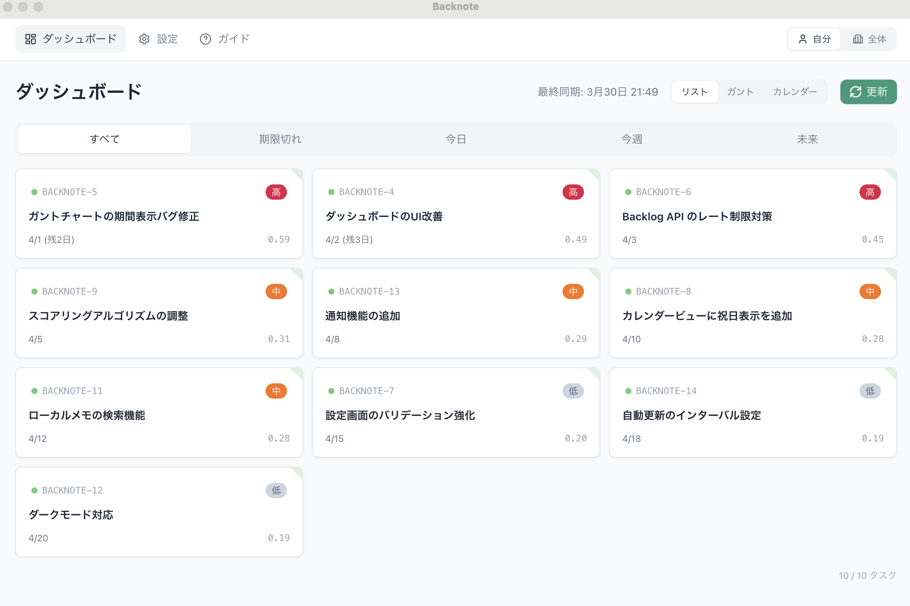
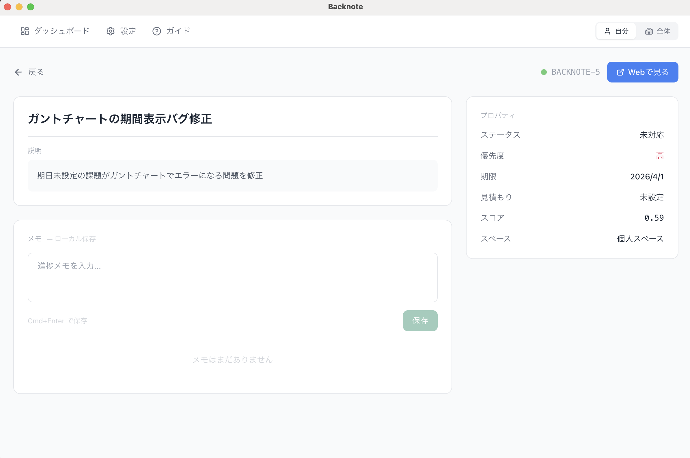
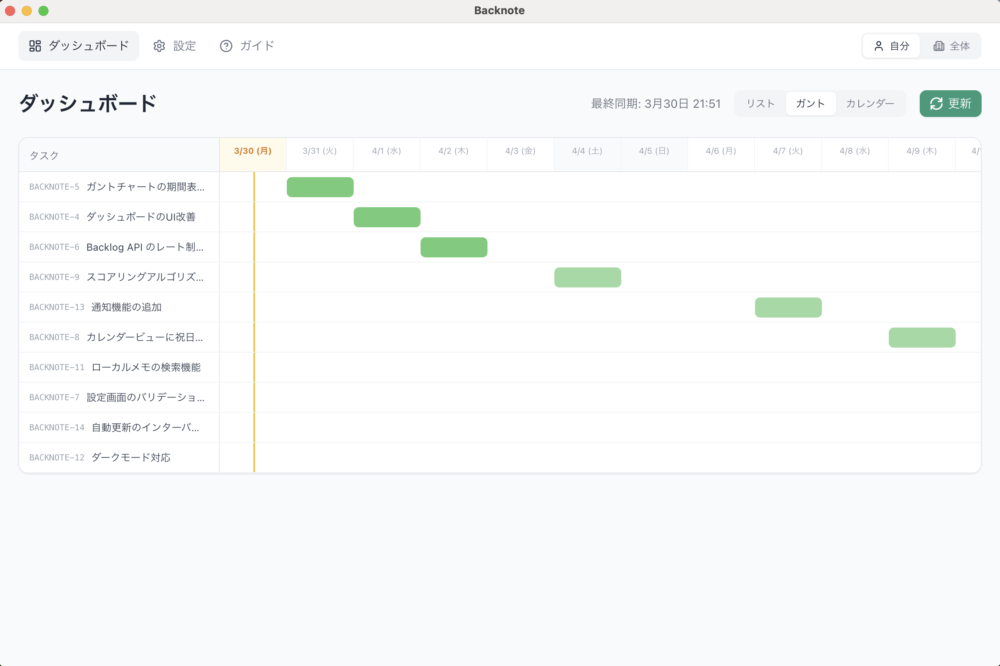
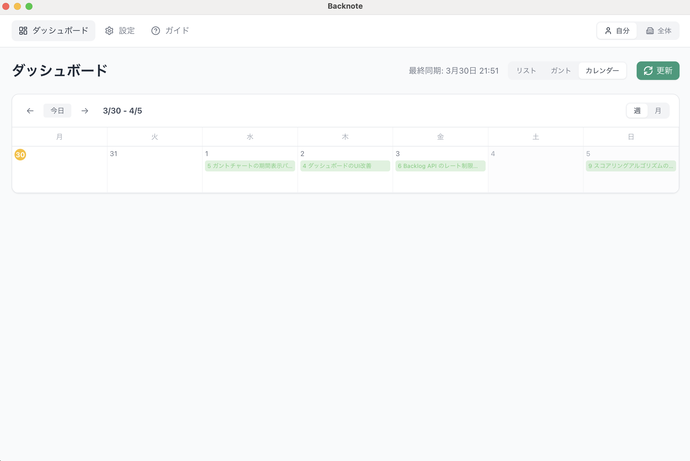
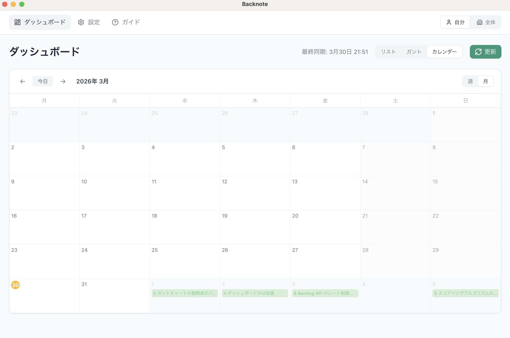
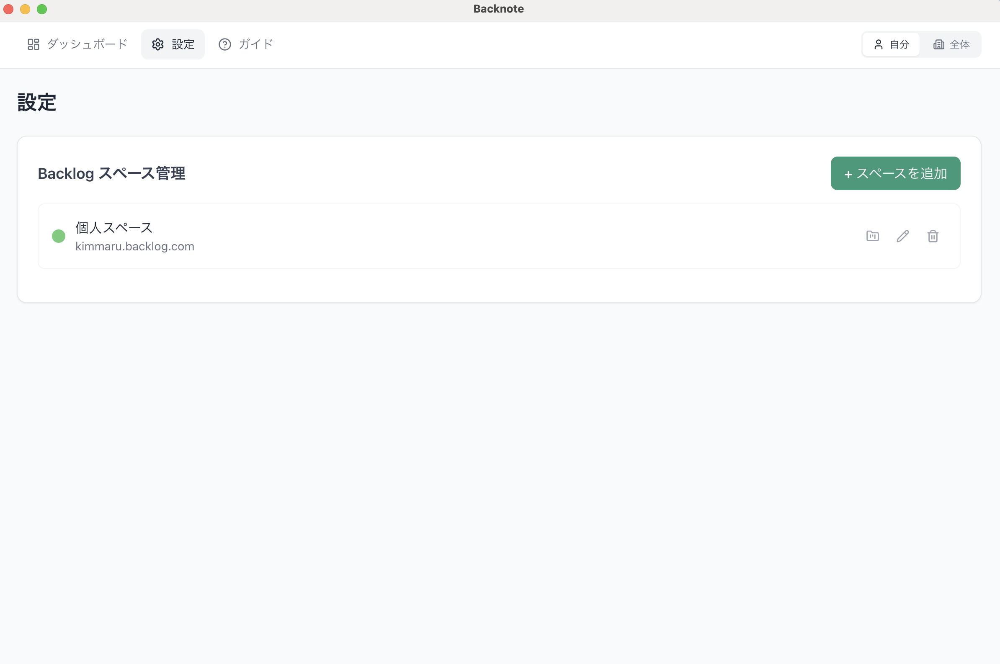
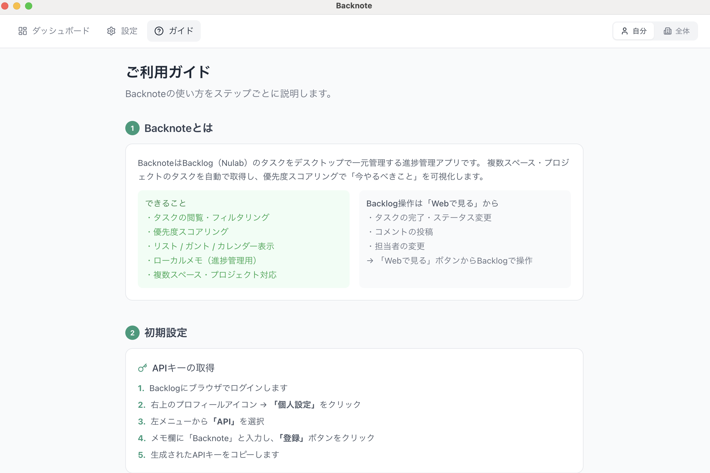

# Backnote

Backlogのタスクをデスクトップで一元管理する進捗管理アプリ。

複数スペース・プロジェクトのタスクを自動取得し、優先度スコアリングで「今やるべきこと」を可視化します。

## 特徴

- **複数スペース・プロジェクト対応** — Backlog（Nulab）の複数スペースを横断管理、プロジェクト単位でフィルタリング
- **優先度スコアリング** — 期限・優先度・工数・マイルストーン・放置度の5要素で自動スコア算出
- **3種の表示形式** — リスト / ガントチャート / カレンダー（週/月）を切り替え
- **自分 / 全体切り替え** — 自分の担当タスクとスペース全体を簡単に切り替え
- **課題詳細 & ローカルメモ** — 課題の詳細確認、Backlogに送信されないローカルメモで進捗管理
- **Webで見る** — ワンクリックでBacklogの課題ページを直接開く
- **完全ローカル動作** — データは端末内に保存。外部サーバー不要、プライバシーに配慮

## スクリーンショット

### ダッシュボード（リスト）


### 課題詳細 & ローカルメモ


### ガントチャート


### カレンダー（週 / 月）



### 設定


### ご利用ガイド


## 技術スタック

| レイヤー | 技術 |
|---|---|
| デスクトップ | Electron（electron-vite） |
| フロントエンド | React + TailwindCSS + lucide-react |
| バックエンド | Go（Echo）— localhost で動作 |
| データベース | SQLite + GORM（ローカル） |
| アニメーション | Lottie + View Transitions API |

## セットアップ

### 前提条件

- Node.js >= 18
- Go >= 1.23
- npm

### インストール

```bash
git clone https://github.com/KimMaru10/Backnote.git
cd Backnote

# フロントエンド依存インストール
npm install

# Goバックエンドビルド
cd backend
go mod tidy
go build -o bin/backnote-backend ./cmd/main.go
cd ..
```

### 開発モードで起動

```bash
npm run dev
```

### 配布用ビルド

```bash
# macOS向け
npm run dist:mac

# Windows向け
npm run dist:win

# 全プラットフォーム
npm run dist
```

## インストール（macOS）

DMG ファイルからインストール後、初回起動時に「"Backnote"は壊れているため開けません」と表示される場合があります。

これは macOS のセキュリティ機能（Gatekeeper）によるもので、アプリ自体に問題はありません。以下の手順で解除できます:

```bash
xattr -cr /Applications/Backnote.app
```

実行後、通常どおりアプリを開けるようになります。

## 使い方

1. アプリを起動
2. **設定**画面でBacklogスペースを登録（ドメイン + APIキー）
3. 必要に応じてプロジェクトを選択
4. **更新**ボタンでタスクを同期
5. リスト / ガント / カレンダーで確認
6. カードクリックで詳細確認、「Webで見る」でBacklogを開く

詳しくはアプリ内の**ガイド**ページをご覧ください。

## スコアリング

各タスクには5つの要素から優先度スコアが自動計算されます:

| 要素 | 重み | 説明 |
|---|---|---|
| 期限緊急度 | 35% | 期限が近いほど高い |
| 優先度 | 25% | 高=1.0 / 中=0.6 / 低=0.3 |
| 放置度 | 20% | 作成日からの経過日数が長いほど高い |
| 工数ペナルティ | 10% | 工数が少ないほど高い |
| マイルストーン | 10% | 7日以内なら加算 |

## フォルダ構成

```
Backnote/
├── src/
│   ├── main/              # Electron Main Process
│   ├── preload/           # IPC ブリッジ
│   └── renderer/src/      # React（UI）
│       ├── components/    # StickyCard, ListView, GanttChart, CalendarView
│       ├── pages/         # Dashboard, Settings, TaskDetail, Guide
│       ├── types/         # 共通型定義
│       └── assets/        # CSS, Lottie, ロゴ
├── backend/               # Go（Echo + GORM）
│   ├── cmd/main.go
│   └── internal/
│       ├── handler/       # APIエンドポイント
│       ├── model/         # DB モデル
│       ├── service/       # スコアリング, スケジューラ, Backlog API, 同期
│       └── store/         # SQLite 接続
├── scripts/               # ビルドスクリプト
├── build/                 # アイコン等ビルドリソース
└── doc/                   # 設計書
```

## ライセンス

MIT
