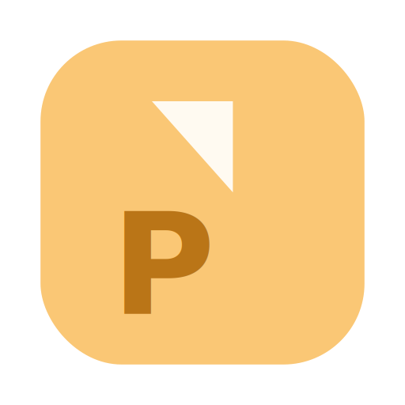

# PeelTask

<p align="center">
  
</p>

<p align="center">
  Backlogのタスクを「付箋を剥がす」感覚で完了していくデスクトップアプリ
</p>

## 特徴

- **複数スペース対応** — Backlog（Nulab）の複数スペースを一元管理
- **自動スケジュール生成** — 優先度スコアに基づき、1日8時間枠でタスクを自動配置
- **3種の表示形式** — リスト / ガントチャート / カレンダーを切り替え
- **付箋剥がしUI** — タスク完了時に付箋がめくれて消えるアニメーション
- **完全ローカル動作** — データは端末内に保存。外部サーバー不要

## 技術スタック

| レイヤー | 技術 |
|---|---|
| デスクトップ | Electron（electron-vite） |
| フロントエンド | React + TailwindCSS |
| バックエンド | Go（Echo）— localhost:8080 で動作 |
| データベース | SQLite + GORM |
| APIキー管理 | electron-store（暗号化保存） |

## フォルダ構成

```
peeltask/
├── electron/          # Electron Main Process / Preload
├── renderer/          # React + TailwindCSS（UI）
├── backend/           # Go（Echo + GORM）
├── doc/               # 設計書（SUDOモデリング）
└── assets/
```

## セットアップ

### 前提条件

- Node.js >= 18
- Go >= 1.21
- npm or yarn

### インストール

```bash
# リポジトリをクローン
git clone https://github.com/your-org/peeltask.git
cd peeltask

# フロントエンド依存インストール
npm install

# Goバックエンドビルド
cd backend
go mod tidy
go build -o ../bin/peeltask-backend ./cmd/main.go
cd ..
```

### 開発モードで起動

```bash
npm run dev
```

## 使い方

1. アプリを起動
2. 設定画面でBacklogスペースのドメインとAPIキーを登録
3. タスクが自動同期され、スケジュールが生成される
4. 完了したタスクの付箋を剥がしていく

## 設計書

[doc/](doc/) フォルダにSUDOモデリングによる設計書があります。

| ドキュメント | 内容 |
|---|---|
| [システム関連図](doc/system-context.md) | システム構成と通信フロー |
| [ユースケース図](doc/usecase.md) | ユーザー操作の一覧と詳細 |
| [ドメインモデル図](doc/domain-model.md) | エンティティの属性と関連 |
| [オブジェクト図](doc/object-diagram.md) | 具体的なデータ例とスコア計算例 |

## ライセンス

MIT
