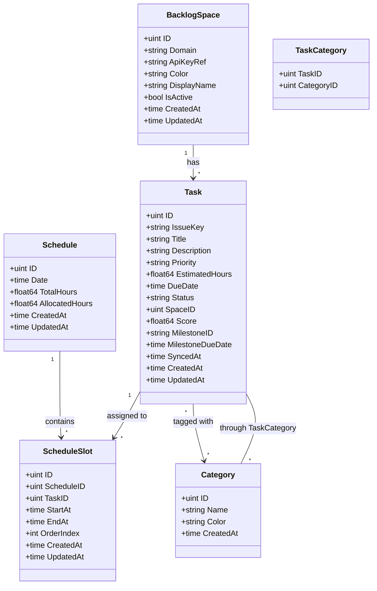
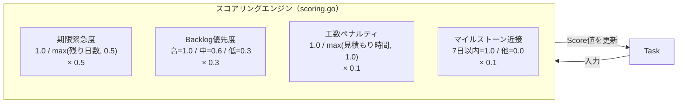
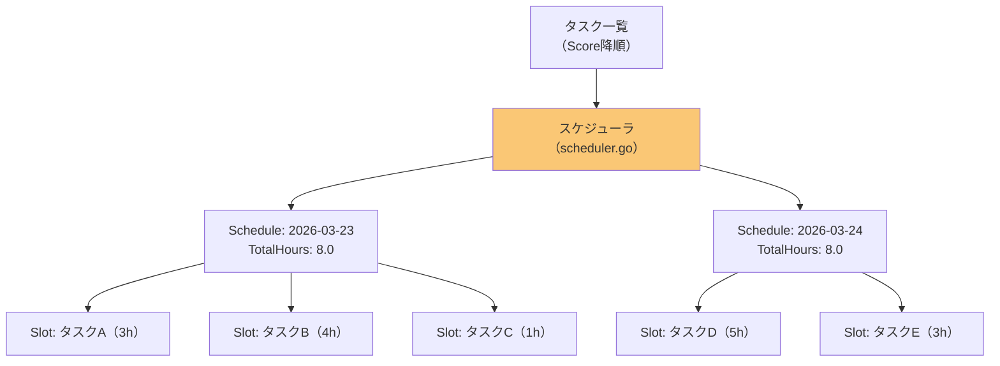

# ドメインモデル図（Domain Model Diagram）

## 概要
PeelTaskの主要エンティティとその関連、属性を示す。

## ドメインモデル図



## エンティティ詳細

### BacklogSpace（Backlogスペース）
Backlogの接続先スペースを管理するエンティティ。

| 属性 | 型 | 説明 |
|---|---|---|
| ID | uint | 主キー |
| Domain | string | Backlogスペースのドメイン（例: `myteam.backlog.com`） |
| ApiKeyRef | string | electron-storeの暗号化キー参照ID（APIキー本体はelectron-storeに保存） |
| Color | string | UI表示用カラーコード（例: `#FF6B6B`） |
| DisplayName | string | UI表示名（例: 「開発チームA」） |
| IsActive | bool | 同期対象かどうか |

### Task（タスク）
Backlogから取得した課題を表すエンティティ。スコアリング結果を保持する。

| 属性 | 型 | 説明 |
|---|---|---|
| ID | uint | 主キー |
| IssueKey | string | Backlogの課題キー（例: `PROJ-123`） |
| Title | string | タスクタイトル |
| Priority | string | Backlog優先度（高/中/低） |
| EstimatedHours | float64 | 見積もり時間 |
| DueDate | time | 期限日 |
| Status | string | ステータス（未対応/処理中/完了 等） |
| SpaceID | uint | 所属スペースID（FK → BacklogSpace） |
| Score | float64 | 算出された優先度スコア |
| MilestoneDueDate | time | マイルストーンの期限日 |
| SyncedAt | time | 最終同期日時 |

### Schedule（スケジュール）
日単位のスケジュール枠。1日8時間を上限とする。

| 属性 | 型 | 説明 |
|---|---|---|
| ID | uint | 主キー |
| Date | time | 対象日 |
| TotalHours | float64 | 1日の総作業時間（デフォルト: 8.0） |
| AllocatedHours | float64 | 割り当て済み時間の合計 |

### ScheduleSlot（スケジュールスロット）
スケジュール内の個別タスク割り当て枠。

| 属性 | 型 | 説明 |
|---|---|---|
| ID | uint | 主キー |
| ScheduleID | uint | 所属スケジュールID（FK → Schedule） |
| TaskID | uint | 割り当てタスクID（FK → Task） |
| StartAt | time | 開始時刻 |
| EndAt | time | 終了時刻 |
| OrderIndex | int | 表示順序（ドラッグ&ドロップで変更可能） |

### Category（カテゴリ）
タスクの分類タグ。

| 属性 | 型 | 説明 |
|---|---|---|
| ID | uint | 主キー |
| Name | string | カテゴリ名 |
| Color | string | UI表示用カラーコード |

## スコアリングロジックの位置づけ



**スコア計算式:**
```
score = 期限緊急度 × 0.5 + Backlog優先度 × 0.3 + 工数ペナルティ × 0.1 + マイルストーン近接 × 0.1
```

## スケジュール生成ロジックの位置づけ



- スコアの高いタスクから順に、当日の8h枠に割り当て
- 枠が溢れたら翌日に繰り越し
