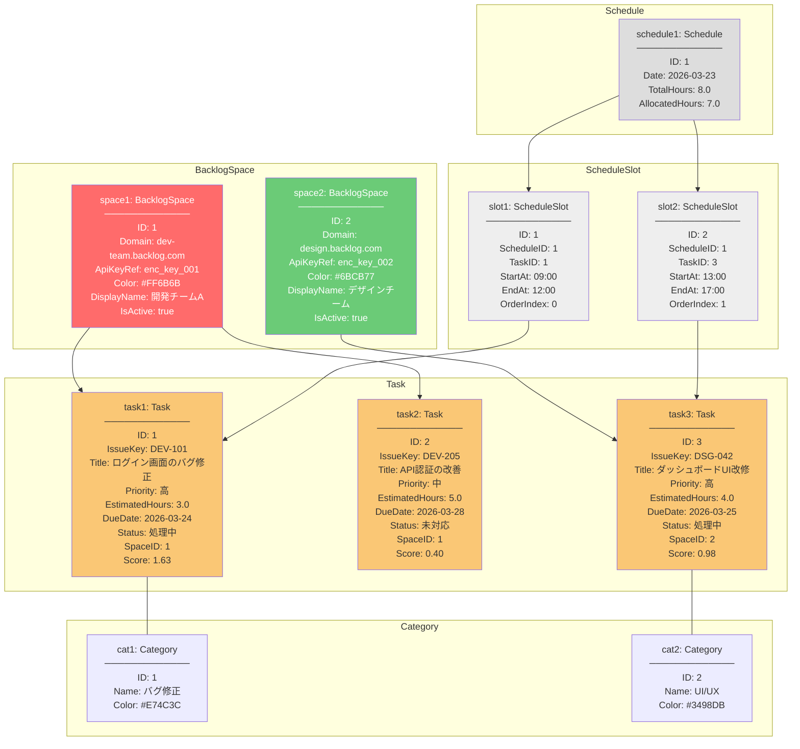

# オブジェクト図（Object Diagram）

## 概要
ドメインモデルの具体的なインスタンス例を示し、データがどのように関連するかを可視化する。

## シナリオ
ユーザーが2つのBacklogスペースを登録し、3つのタスクが同期済み。
2026年3月23日（月）のスケジュールが自動生成された状態。

## オブジェクト図



## スコアリング計算例

### task1: DEV-101（ログイン画面のバグ修正）

```
前提: 今日 = 2026-03-23

① 期限緊急度 = 1.0 / max(残り日数, 0.5)
   残り日数 = 2026-03-24 - 2026-03-23 = 1日
   → 1.0 / max(1, 0.5) = 1.0

② Backlog優先度 = 高 → 1.0

③ 工数ペナルティ = 1.0 / max(見積もり時間, 1.0)
   → 1.0 / max(3.0, 1.0) = 0.333

④ マイルストーン近接 = マイルストーンなし → 0.0

score = 1.0 × 0.5 + 1.0 × 0.3 + 0.333 × 0.1 + 0.0 × 0.1
      = 0.50 + 0.30 + 0.033 + 0.00
      = 0.833
```

### task2: DEV-205（API認証の改善）

```
① 期限緊急度 = 1.0 / max(5, 0.5) = 0.2
② Backlog優先度 = 中 → 0.6
③ 工数ペナルティ = 1.0 / max(5.0, 1.0) = 0.2
④ マイルストーン近接 = なし → 0.0

score = 0.2 × 0.5 + 0.6 × 0.3 + 0.2 × 0.1 + 0.0 × 0.1
      = 0.10 + 0.18 + 0.02 + 0.00
      = 0.30
```

### task3: DSG-042（ダッシュボードUI改修）

```
① 期限緊急度 = 1.0 / max(2, 0.5) = 0.5
② Backlog優先度 = 高 → 1.0
③ 工数ペナルティ = 1.0 / max(4.0, 1.0) = 0.25
④ マイルストーン近接 = 7日以内のマイルストーンあり → 1.0

score = 0.5 × 0.5 + 1.0 × 0.3 + 0.25 × 0.1 + 1.0 × 0.1
      = 0.25 + 0.30 + 0.025 + 0.10
      = 0.675
```

### スコア順（降順）
| 順位 | タスク | スコア |
|---|---|---|
| 1 | DEV-101 ログイン画面のバグ修正 | 0.833 |
| 2 | DSG-042 ダッシュボードUI改修 | 0.675 |
| 3 | DEV-205 API認証の改善 | 0.30 |

## スケジュール割り当て例

```mermaid
gantt
    title 2026-03-23（月）のスケジュール
    dateFormat HH:mm
    axisFormat %H:%M

    section スコア順割当
    DEV-101 ログイン画面のバグ修正（3h）  :active, 09:00, 3h
    DSG-042 ダッシュボードUI改修（4h）    :active, 13:00, 4h
```



- スコア1位の DEV-101（3h）→ 09:00〜12:00 に配置
- スコア2位の DSG-042（4h）→ 13:00〜17:00 に配置
- 合計 7h / 8h（残り1h枠あり）
- スコア3位の DEV-205（5h）→ 残り1hでは入りきらないため翌日に繰り越し
