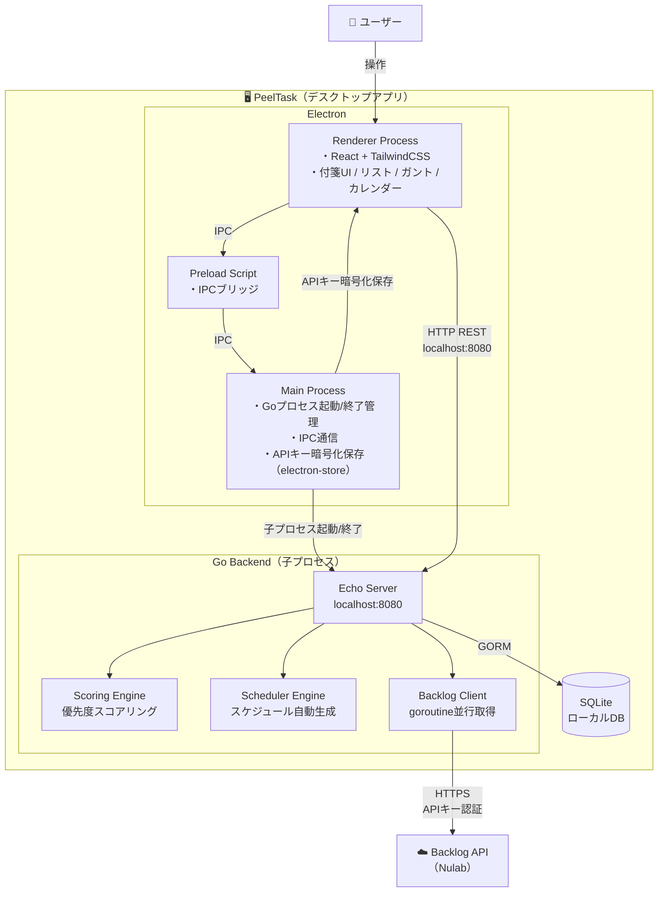
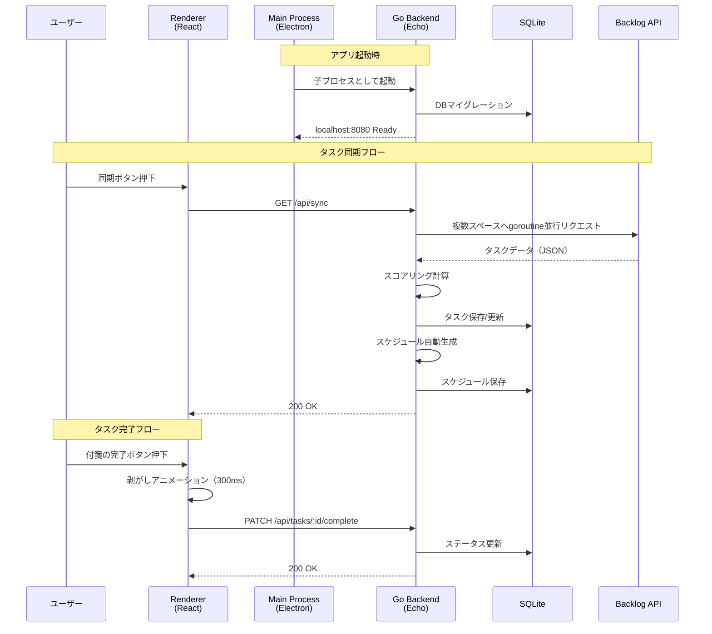

# システム関連図（System Context Diagram）

## 概要
PeelTaskのシステム境界と、外部アクター・外部システムとの関係を示す。

## システム関連図

## 通信フロー

## 外部依存

| 外部システム | 通信方式 | 認証 | 備考 |
|---|---|---|---|
| Backlog API（Nulab） | HTTPS | APIキー | ユーザーが各自設定。electron-storeで暗号化保存 |
| ファイルシステム | ローカル | なし | SQLiteファイル保存先 |

## 補足
- Go BackendはElectron Main Processの子プロセスとして起動され、アプリ終了時に自動停止する
- すべての通信はローカル（localhost）で完結。外部サーバーへの公開は不要
- Backlog APIへのリクエストはユーザーのPCから直接送信される（中間サーバーなし）
- 15分ごとにバックグラウンドでBacklog APIと自動同期
