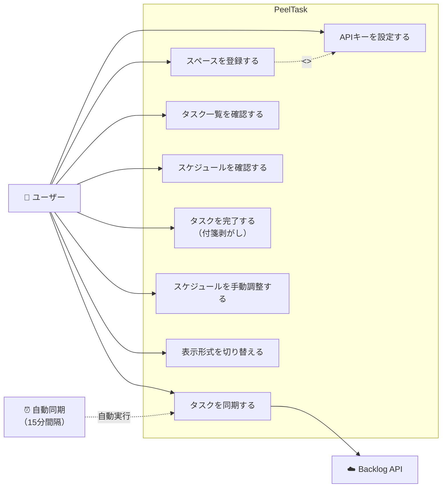

# ユースケース図（Use Case Diagram）

## 概要
PeelTaskにおけるユーザーの主要な操作とシステムの振る舞いを示す。

## ユースケース図

## ユースケース詳細

### UC1: スペースを登録する
| 項目 | 内容 |
|---|---|
| アクター | ユーザー |
| 事前条件 | アプリが起動している |
| 基本フロー | 1. 設定画面を開く 2. スペースのドメイン名を入力 3. APIキーを入力 4. 表示名・カラーを設定 5. 接続テスト 6. 保存 |
| 事後条件 | スペースがDB（BacklogSpace）に保存され、APIキーがelectron-storeで暗号化保存される |
| 備考 | 複数スペースを登録可能 |

### UC2: APIキーを設定する
| 項目 | 内容 |
|---|---|
| アクター | ユーザー |
| 事前条件 | スペース登録フロー内 |
| 基本フロー | 1. APIキーを入力 2. electron-storeで暗号化保存 3. Backlog APIへの接続テスト |
| 事後条件 | APIキーが暗号化されてローカルに保存される |

### UC3: タスクを同期する
| 項目 | 内容 |
|---|---|
| アクター | ユーザー / 自動同期タイマー |
| 事前条件 | 1つ以上のスペースが登録済み |
| 基本フロー | 1. 登録済みの全スペースに対しgoroutineで並行リクエスト 2. Backlog APIからタスクデータ取得 3. スコアリングエンジンで優先度スコア計算 4. SQLiteにタスク保存/更新 5. スケジュール自動生成 |
| 事後条件 | ローカルDBが最新のタスクデータで更新され、スケジュールが再生成される |
| 備考 | 15分間隔で自動実行。手動トリガーも可能 |

### UC4: タスク一覧を確認する
| 項目 | 内容 |
|---|---|
| アクター | ユーザー |
| 事前条件 | タスクが同期済み |
| 基本フロー | 1. ダッシュボードに付箋形式でタスク一覧表示 2. スコア順にソートされた状態で表示 3. 各タスクにスペースカラー・優先度・期限を表示 |
| 事後条件 | なし（参照のみ） |

### UC5: スケジュールを確認する
| 項目 | 内容 |
|---|---|
| アクター | ユーザー |
| 事前条件 | スケジュールが生成済み |
| 基本フロー | 1. リスト形式（今日/今週/来週）で確認 2. ガントチャートで確認 3. カレンダー（週/月）で確認 |
| 事後条件 | なし（参照のみ） |

### UC6: タスクを完了する（付箋剥がし）
| 項目 | 内容 |
|---|---|
| アクター | ユーザー |
| 事前条件 | タスクが表示されている |
| 基本フロー | 1. タスクの完了ボタンを押す 2. 付箋が右上からめくれるアニメーション（300ms） 3. カードがスタックから消え、下のカードが上にスライド 4. バックエンドにステータス更新リクエスト |
| 事後条件 | タスクのステータスが「完了」に更新される |
| 備考 | UXの核心。アニメーション仕様はStickyCard.tsxで実装 |

### UC7: スケジュールを手動調整する
| 項目 | 内容 |
|---|---|
| アクター | ユーザー |
| 事前条件 | スケジュールが生成済み |
| 基本フロー | 1. ガントチャート上でタスクをドラッグ&ドロップ 2. 順序や日付を調整 3. バックエンドにスケジュール更新リクエスト |
| 事後条件 | スケジュールスロットのorderIndex/日付が更新される |
| 備考 | react-beautiful-dndを使用 |

### UC8: 表示形式を切り替える
| 項目 | 内容 |
|---|---|
| アクター | ユーザー |
| 事前条件 | スケジュールが生成済み |
| 基本フロー | 1. リスト/ガント/カレンダーのタブを切り替え |
| 事後条件 | 選択した形式でスケジュールが再描画される |
